# News Headline Topic Classification (CSE440 Final Project)

This project classifies news headlines into one of four topics: **Business**, **Science and Technology**, **Sports**, or **World News**. It looks at how much text preprocessing matters, compares two text representations (TF-IDF and Skip-gram Word2Vec), and tests eight models, from Logistic Regression up to bidirectional LSTMs.

**Best result:** TF-IDF features with a Deep Neural Network and *extreme* preprocessing reached **91.16% accuracy** and **0.911 macro-F1** on the 12,000-headline test set.

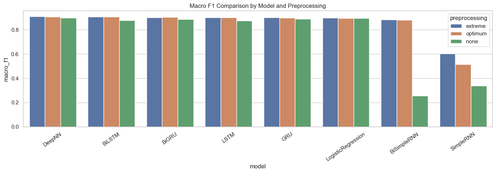

---

## Contents

- [Dataset](#dataset)
- [Pipeline](#pipeline)
- [Exploratory Data Analysis](#exploratory-data-analysis)
- [Preprocessing Variants](#preprocessing-variants)
- [Models and Hyperparameter Search](#models-and-hyperparameter-search)
- [Results](#results)
- [Confusion Matrices](#confusion-matrices)
- [Key Findings](#key-findings)
- [Repository Structure](#repository-structure)
- [How to Run](#how-to-run)

---

## Dataset

| File | Rows | Columns |
|---|---|---|
| `Training_data_9.csv` | 88,829 | `News Headline`, `News Topic` |
| `Test_data.csv` | 12,000 (3,000 per class) | `News Headline`, `News Topic` |

The raw headlines are wrapped in HTML markup (`<html> <body> News Headlines: <br> <b> ... </b>`), so cleaning is an important step. The training set is **imbalanced**:

| Class | Training samples |
|---|---|
| Sports | 35,668 |
| World News | 31,613 |
| Business | 11,801 |
| Science and Technology | 9,747 |

The training data is split 85/15 (stratified) into **75,504 train** and **13,325 validation** rows. The validation split is used for hyperparameter selection, and the untouched test set is used for final scores.

---

## Pipeline

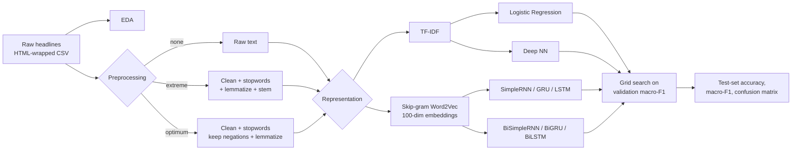

This produces **24 final experiments** (3 preprocessing settings × 8 models) and **132 tuning runs**.

---

## Exploratory Data Analysis

**Class distribution.** Sports and World News together make up about 75% of the training data.

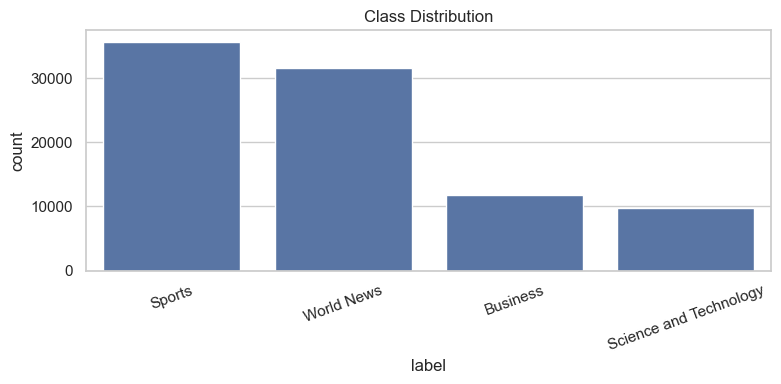

**Headline length.** Most headlines are 25–50 words long once HTML is removed, and the length distribution is similar across classes. That supports a fixed padded sequence length of 60 tokens for the RNN models.

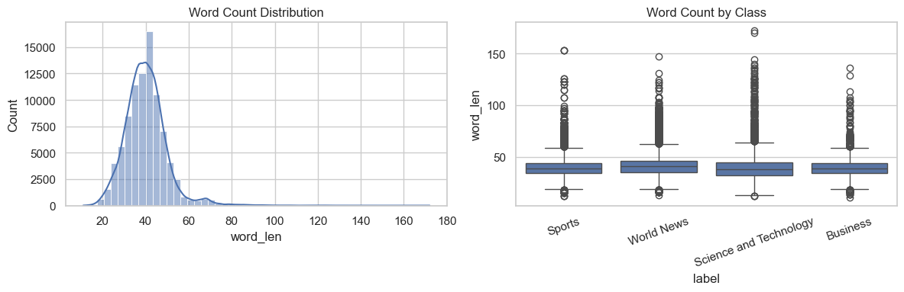

**Word cloud.** Before cleaning, the most frequent tokens are boilerplate (`news`, `headlines:`), HTML entities (`#39;s`), and stopwords. This is why the preprocessing step matters.


---

## Preprocessing Variants

| Variant | Steps |
|---|---|
| **none** | Raw text, unchanged |
| **extreme** | HTML unescape and tag removal, URL removal, keep letters only, lowercase, tokenize, remove all stopwords, lemmatize (WordNet), stem (Porter) |
| **optimum** | Same cleaning as extreme, but **keeps negations** (`no`, `not`, `nor`) and **skips stemming** so words stay readable |

---

## Models and Hyperparameter Search

### TF-IDF models

| Model | Architecture | Grid searched |
|---|---|---|
| Logistic Regression | scikit-learn, `lbfgs` solver | `max_features` ∈ {5000, 8000}, `ngram_range` ∈ {(1,1), (1,2)}, `C` ∈ {0.5, 1.0, 2.0} |
| Deep NN | Dense(d1) → Dropout → Dense(d2) → Dropout → Dense(64) → Softmax | `d1` ∈ {256, 384}, `d2` ∈ {128, 192}, dropout ∈ {0.35, 0.5}, 8 epochs, early stopping |

### Skip-gram sequence models

The Word2Vec Skip-gram model (100 dimensions, window 5, `min_count` 2, 10 epochs) is trained on each preprocessed training set. It becomes a **frozen** embedding layer with a 30,000-word vocabulary and a sequence length of 60. Each recurrent layer is followed by dropout and a softmax output layer.

| Models | Grid searched |
|---|---|
| SimpleRNN, GRU, LSTM, BiSimpleRNN, BiGRU, BiLSTM | units ∈ {64, 96}, dropout ∈ {0.4, 0.5}, Adam lr = 1e-3, 6 epochs |

All 132 tuning configurations and their validation macro-F1 scores are in [`Result/tuning_logs_table.csv`](Result/tuning_logs_table.csv).

---

## Results

Test-set scores for the best configuration of each experiment, sorted by macro-F1 (from [`Result/final_results_table.csv`](Result/final_results_table.csv)):

| # | Preprocessing | Representation | Model | Accuracy | Macro-F1 |
|---|---|---|---|---|---|
| 1 | extreme | TF-IDF | **DeepNN** | **0.9116** | **0.9111** |
| 2 | extreme | Skip-gram | BiLSTM | 0.9086 | 0.9082 |
| 3 | optimum | TF-IDF | DeepNN | 0.9084 | 0.9079 |
| 4 | optimum | Skip-gram | BiLSTM | 0.9083 | 0.9078 |
| 5 | optimum | Skip-gram | BiGRU | 0.9049 | 0.9042 |
| 6 | optimum | Skip-gram | LSTM | 0.9033 | 0.9025 |
| 7 | extreme | Skip-gram | GRU | 0.9019 | 0.9009 |
| 8 | extreme | Skip-gram | LSTM | 0.9014 | 0.9005 |
| 9 | extreme | Skip-gram | BiGRU | 0.9009 | 0.9002 |
| 10 | none | TF-IDF | DeepNN | 0.9005 | 0.9000 |
| 11 | optimum | Skip-gram | GRU | 0.8997 | 0.8990 |
| 12 | extreme | TF-IDF | LogisticRegression | 0.8984 | 0.8975 |
| 13 | none | TF-IDF | LogisticRegression | 0.8977 | 0.8969 |
| 14 | optimum | TF-IDF | LogisticRegression | 0.8969 | 0.8959 |
| 15 | none | Skip-gram | GRU | 0.8917 | 0.8908 |
| 16 | none | Skip-gram | BiGRU | 0.8873 | 0.8866 |
| 17 | extreme | Skip-gram | BiSimpleRNN | 0.8851 | 0.8841 |
| 18 | optimum | Skip-gram | BiSimpleRNN | 0.8814 | 0.8805 |
| 19 | none | Skip-gram | BiLSTM | 0.8800 | 0.8780 |
| 20 | none | Skip-gram | LSTM | 0.8770 | 0.8753 |
| 21 | extreme | Skip-gram | SimpleRNN | 0.6854 | 0.6029 |
| 22 | optimum | Skip-gram | SimpleRNN | 0.5978 | 0.5160 |
| 23 | none | Skip-gram | SimpleRNN | 0.4658 | 0.3370 |
| 24 | none | Skip-gram | BiSimpleRNN | 0.3366 | 0.2552 |

---

## Confusion Matrices

### Best model: extreme preprocessing, TF-IDF, Deep NN


Sports is almost always classified correctly (2,943 of 3,000). Most errors come from confusing **Business** with **Science and Technology**, which is expected because tech-company and market news overlap heavily.

### TF-IDF models

| | Logistic Regression | Deep NN |
|---|---|---|
| **none** | 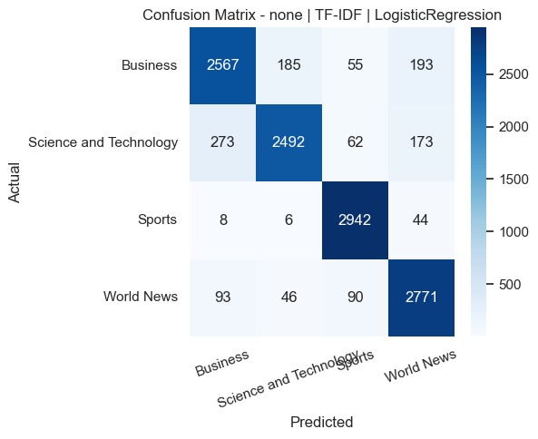 |  |
| **extreme** |  |  |
| **optimum** |  | 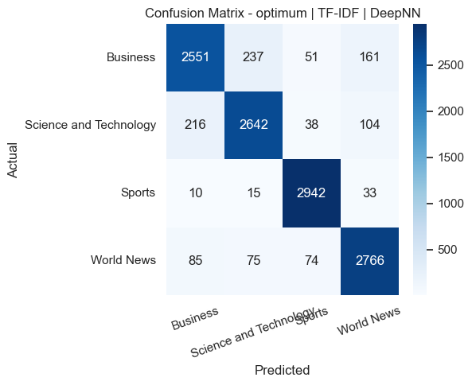 |

### Skip-gram sequence models

<details>
<summary><b>No preprocessing</b> (click to expand)</summary>

| SimpleRNN | GRU | LSTM |
|---|---|---|
| 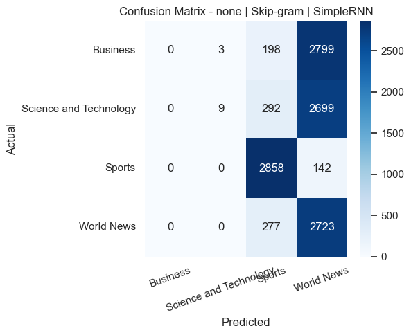 | 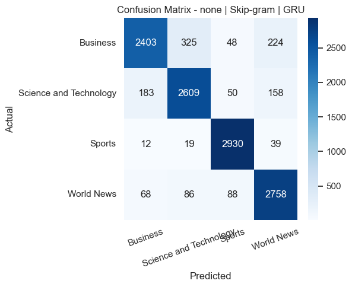 | 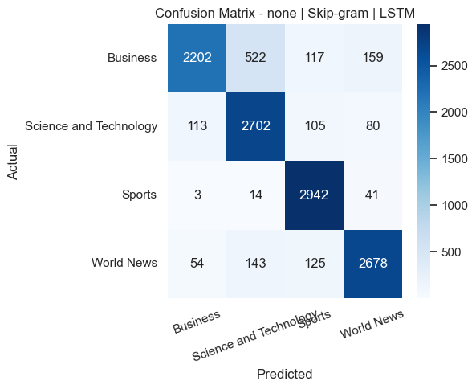 |
| **BiSimpleRNN** | **BiGRU** | **BiLSTM** |
| 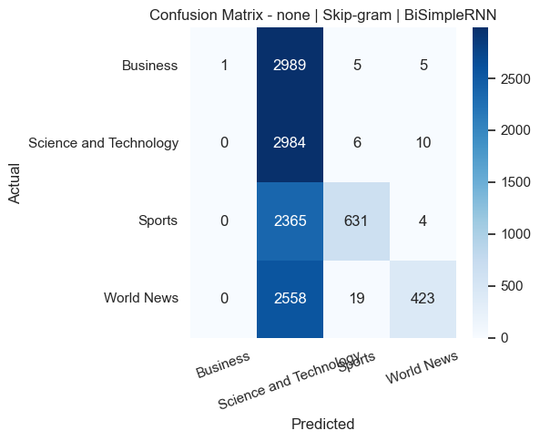 |  |  |

</details>

<details>
<summary><b>Extreme preprocessing</b> (click to expand)</summary>

| SimpleRNN | GRU | LSTM |
|---|---|---|
| 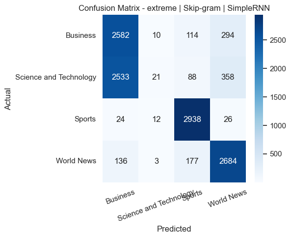 | 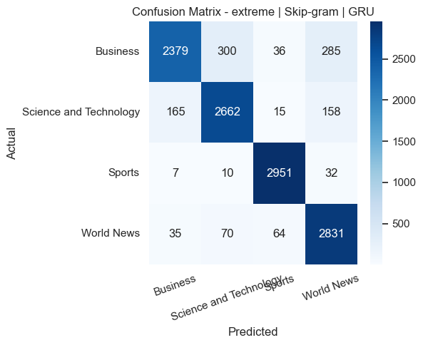 | 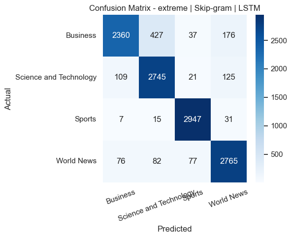 |
| **BiSimpleRNN** | **BiGRU** | **BiLSTM** |
| 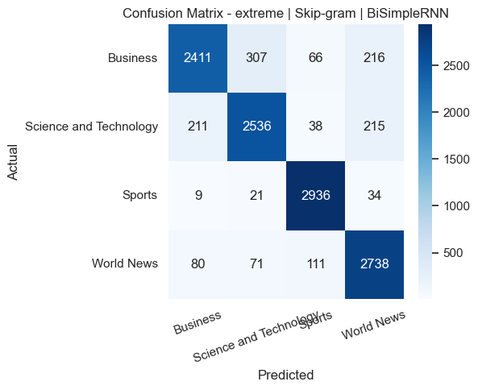 | 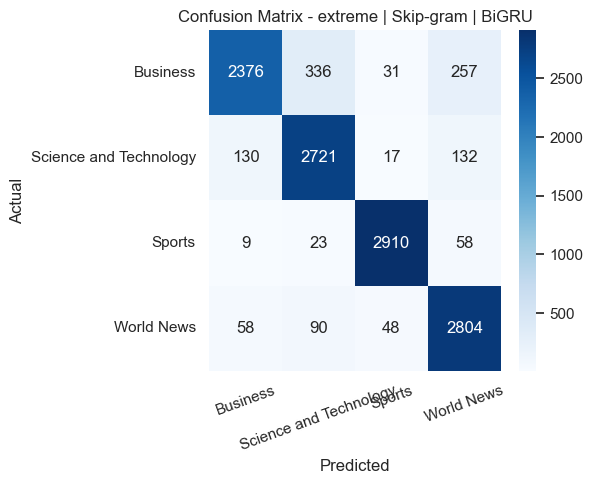 |  |

</details>

<details>
<summary><b>Optimum preprocessing</b> (click to expand)</summary>

| SimpleRNN | GRU | LSTM |
|---|---|---|
| 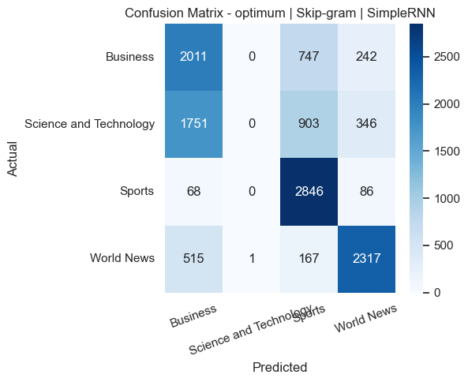 | 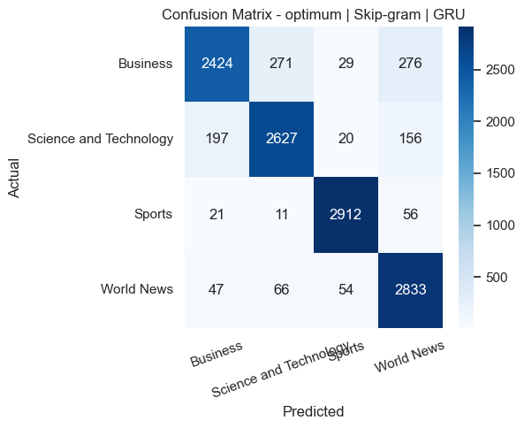 | 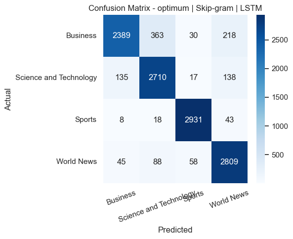 |
| **BiSimpleRNN** | **BiGRU** | **BiLSTM** |
| 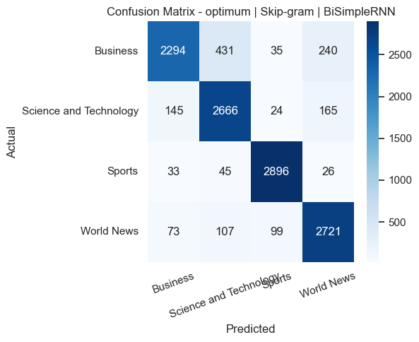 |  |  |

</details>

---

## Key Findings

1. **Preprocessing helps every neural model.** Going from *none* to *extreme* or *optimum* raised macro-F1 for every Skip-gram model. The biggest gains were for the weakest models: BiSimpleRNN went from 0.26 to 0.88. Logistic Regression barely changed (0.896–0.898), because TF-IDF already down-weights common boilerplate tokens.
2. **Extreme and optimum preprocessing perform about the same.** The top four results alternate between the two, separated by less than 0.004 macro-F1. Keeping negations and skipping stemming neither helped nor hurt much on topic classification.
3. **Gated RNNs are much better than plain RNNs.** GRU, LSTM, and their bidirectional versions all scored 0.88–0.91, while SimpleRNN never went above 0.60. Its training logs show unstable runs that collapse toward predicting the majority class, a typical sign of vanishing or exploding gradients over 60-token sequences.
4. **Bidirectional models give a small boost.** BiLSTM was the best Skip-gram model under both cleaned preprocessing settings.
5. **A simple TF-IDF Deep NN is as good as the RNNs.** For short, keyword-heavy text like headlines, bag-of-words features with a Dense network matched or beat the sequence models at a much lower training cost.
6. **Business and Science/Technology are the hardest classes to separate**, in every model's confusion matrix.

---

## Repository Structure

```
CSE440-Project/
├── Training_data_9.csv                     # Training set (88,829 headlines)
├── Test_data.csv                           # Test set (12,000 headlines)
├── CSE440_Project_Redone_From_Labs.ipynb   # Same pipeline rebuilt in the course-lab style (not executed)
├── Result/
│   ├── CSE440_Project_Completed .ipynb     # Fully executed notebook with all outputs
│   ├── final_results_table.csv             # Test scores for all 24 experiments
│   └── tuning_logs_table.csv               # Validation scores for all 132 tuning runs
└── images/                                 # Figures extracted from the executed notebook
```

---

## How to Run

1. Install the dependencies (Python 3.10+):

   ```bash
   pip install pandas numpy scikit-learn matplotlib seaborn nltk gensim wordcloud tensorflow
   ```

2. Open `Result/CSE440_Project_Completed .ipynb` (or `CSE440_Project_Redone_From_Labs.ipynb`) in Jupyter or VS Code.

3. In the **Load Dataset** cell, change the hard-coded CSV paths (`D:\My Projects\CSE440/...`) to point at `Training_data_9.csv` and `Test_data.csv` in this repo.

4. Run all cells. The NLTK resources (`punkt`, `punkt_tab`, `stopwords`, `wordnet`, `omw-1.4`) download automatically.

> **Tip:** Set `FAST_MODE = True` in the split cell to subsample 2,500 headlines per class for quick debugging. Keep it `False` for the full results. A full run on CPU takes several hours because of the grid search over 132 configurations.
